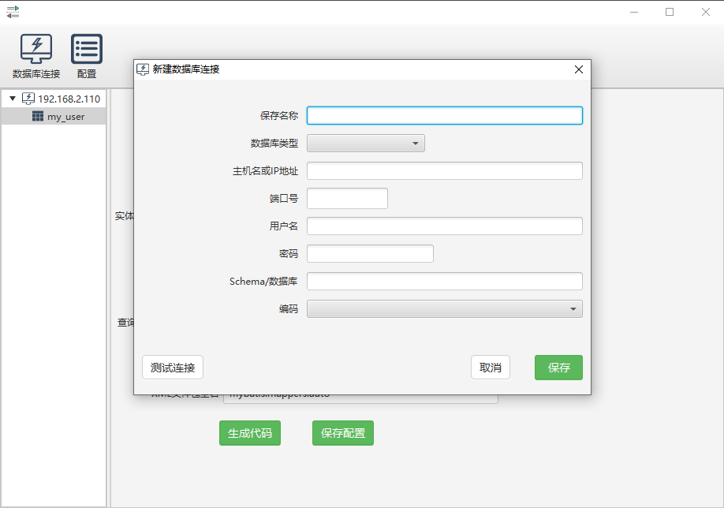
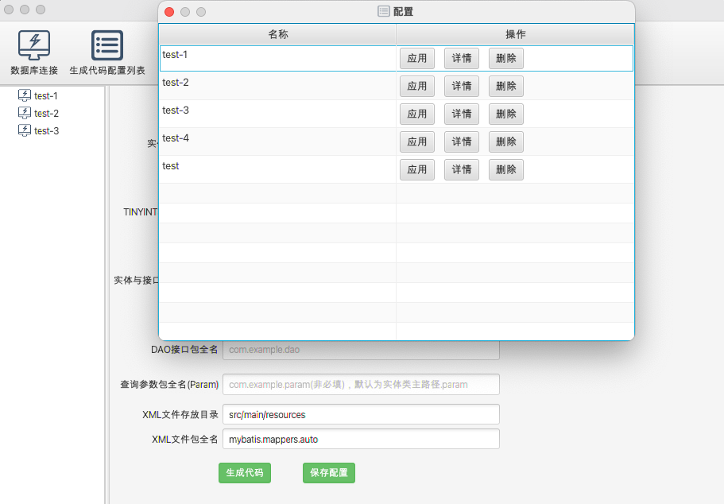
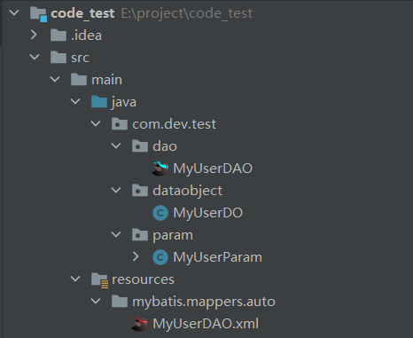

# mybatis-generator

#### 简介
该工具基于mybatis-generator-gui项目进行重构，调整原工具配置界面，并根据自己实际开发习惯进行了相应调整，主要修改点如下：
- 升级mybatis-generator-core版本到1.3.7
- 升级MySQL驱动文件版本到8.0.30，兼容MySQL8.0以下版本，已满足生产绝大部分需求
- 重构配置界面，优化配置项，使其语义更加明确
- 插件默认化，无需勾选，默认常用插件，且重构&添加相关插件，主要包含：批量插入插件、example替换插件、注释插件、排序插件、分页插件、xml文件覆写插件
- 优化查询参数，参考自己生产使用情况，使其更符合自身开发习惯
- 实体对象与查询参数默认分目录存放，也可自定义配置，实现灵活管控
- 由于实际开发需求，目前只对MySQL数据库进行了测试，其他数据库可能会存在问题
- 原项目地址:https://github.com/zouzg/mybatis-generator-gui ,感谢原作者的无私奉献！

#### 相关说明
##### 工具运行相关界面

代码生成截图如下：

##### 如何运行
###### jdk版本最低要求>=1.8

- 下载项目后，直接运行：com.itcrazy.mybatis.generator.MainApplication
- 做成安装包，正在摸索中.............