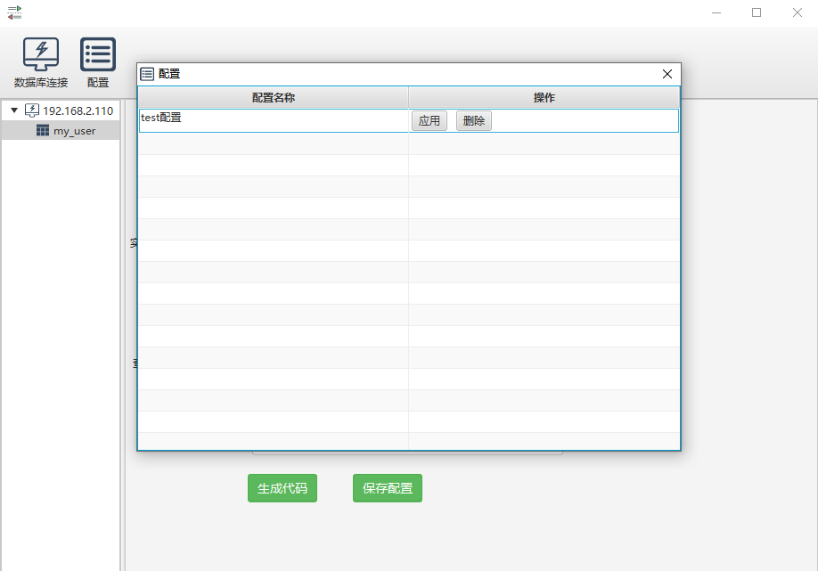

# mybatis-generator

#### 简介
该工具基于mybatis-generator-gui项目进行重构，调整原工具配置界面，并根据自己实际开发习惯进行相应调整，主要修改点如下：
- 升级mybatis-generator-core版本到1.3.7
- 升级MySQL驱动文件版本到8.0.30，兼容MySQL8.0以下版本，已满足绝大部分生产需求
- 重构配置界面，优化配置项，使其语义更加明确
- 插件默认化，无需勾选，默认常用插件，且重构&添加相关插件，主要包含：批量插入插件、example内容替换插件、注释插件、排序插件、分页插件、xml文件覆写插件、TINYINT默认转换成Boolean插件
- 优化查询参数，参考自己生产使用情况，使其更符合开发习惯
- 实体对象与查询参数默认分目录存放，也可自定义配置，实现灵活管控
- 由于实际开发需求，目前只对MySQL数据库进行了测试，其他数据库未进行相应测试
- 原项目地址: https://github.com/zouzg/mybatis-generator-gui ,感谢原作者的无私奉献！

#### 相关说明
##### 工具运行相关界面




<font color=red>代码生成截图如下：</font>


##### 如何运行
###### <font color=red>jdk版本要求>=1.8&&<=11，jdk版本不能太高，超过11运行可能会出现问题，建议使用jdk1.8</font>

- 下载项目后，直接运行：com.itcrazy.mybatis.generator.MainApplication
- 自行构建项目
  ```html
  git clone git@gitee.com:itcrazy0717/mybatis-generator.git
  cd mybatis-generator
  mvn jfx:jar
  cd target/jfx/app/
  java -jar mybatis-generator-gui.jar
  ```
  通过该方式可对使用sh脚本来创建快捷运行指令，启动非常方便